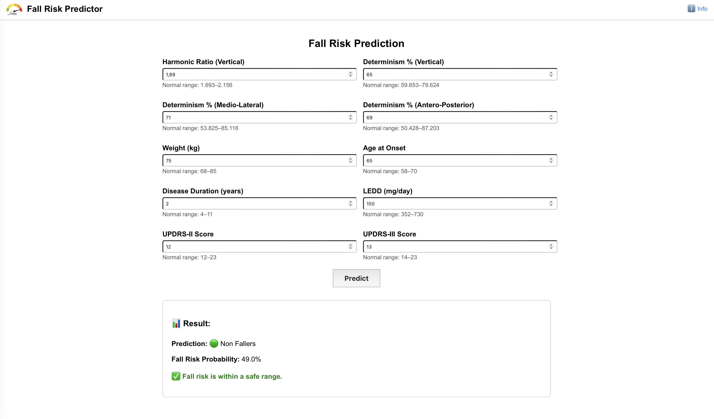

# 🧠 Fall Risk Predictor

> A fullstack AI-powered web application to assess fall risk in patients with Parkinson's Disease. (coming soon)

## 🖼️ Demo Preview

## 🚀 Project Overview

**Fall Risk Predictor** is a clinically-oriented web application designed to predict the likelihood of falls in Parkinson’s patients using a machine learning model based on real-world clinical and biomechanical features. It provides an intuitive interface, interpretable outputs, and smart tooltips showing normal reference ranges for each parameter.

## 🧩 Tech Stack

- **Frontend**: React (with Axios) — deployed on [Vercel](https://vercel.com)
- **Backend**: Django REST Framework — deployed on [Render](https://render.com)
- **Model**: Random Forest Classifier with feature selection and scaling
- **ML Tools**: `scikit-learn`, `joblib`, `pandas`, `numpy`
- **Other**: HTTPS CORS handling, custom visual feedback, deployment automation

## 📊 Features Used for Prediction

| Feature Name      | Description                              |
|-------------------|------------------------------------------|
| `hr_v`            | Harmonic Ratio – Vertical                |
| `%det_v`          | % Determinism – Vertical                 |
| `%det_ml`         | % Determinism – Medio-Lateral            |
| `%det_ap`         | % Determinism – Antero-Posterior         |
| `weigth`          | Patient's Weight (kg)                    |
| `age_onset`       | Age at disease onset                     |
| `duration_years`  | Disease duration in years                |
| `ledd`            | Levodopa Equivalent Daily Dose (mg/day) |
| `updrs-ii`        | UPDRS-II score (Activities of Daily Living) |
| `updrs-iii`       | UPDRS-III score (Motor Evaluation)       |

## 💡 Key Functionalities

- Clean and responsive UI for clinical environments
- Dynamic tooltips for each feature showing quartile-based reference ranges
- Real-time prediction based on ML inference
- Output includes:
  - Prediction (🟢 Non Fallers / 🟠 Fallers)
  - Fall probability (as a percentage)
  - Color-coded warning for high-risk cases (≥ 88%)

## 🔄 System Architecture

User (React UI)
↓ Axios
Django API @ /api/predict/ & /api/ranges/
↓
Scikit-learn model (Random Forest)

## ⚙️ How to Run Locally

# Clone the repository
git clone https://github.com/DanteTrb/fall-risk-predictor.git
cd fall-risk-predictor

# Backend setup
cd backend
pip install -r requirements.txt
python manage.py runserver

# Frontend setup
cd ../frontend
npm install
npm start

📝 Note: For production, the backend is hosted on Render and the frontend on Vercel. Axios paths are automatically routed correctly in production via proxy rules.

## 🌐 Live Demo
Frontend:
[fall-risk-predictor-hazel.vercel.app](https://fall-risk-predictor-hazel.vercel.app)
(Backend hosted on Render — may take up to 50 seconds to wake up if idle.)

## 📦 Deployment Status
| Component | Platform    | Status            |
| --------- | ----------- | ----------------- |
| Frontend  | Vercel      | ✅ Live            |
| Backend   | Render      | ✅ Live            |
| Domain    | fallrisk.ai | ⏳ Configuring DNS |

## 👨‍⚕️ Author
Dante Trabassi
Biomedical Engineer | PhD Neuroscience | Sapienza University of Rome
Researcher in AI for Movement Disorders, Clinical Gait Analysis, Generative and xAI Models

## 📄 License
This project is licensed under the MIT License.
See LICENSE for full terms.

## 🤝 Contributing
Pull requests and suggestions are welcome!
If you're a clinician, data scientist, or ML researcher interested in neurodegenerative disorders, neuroscience and fall risk, feel free to collaborate.
